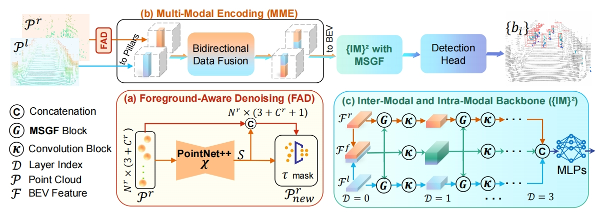
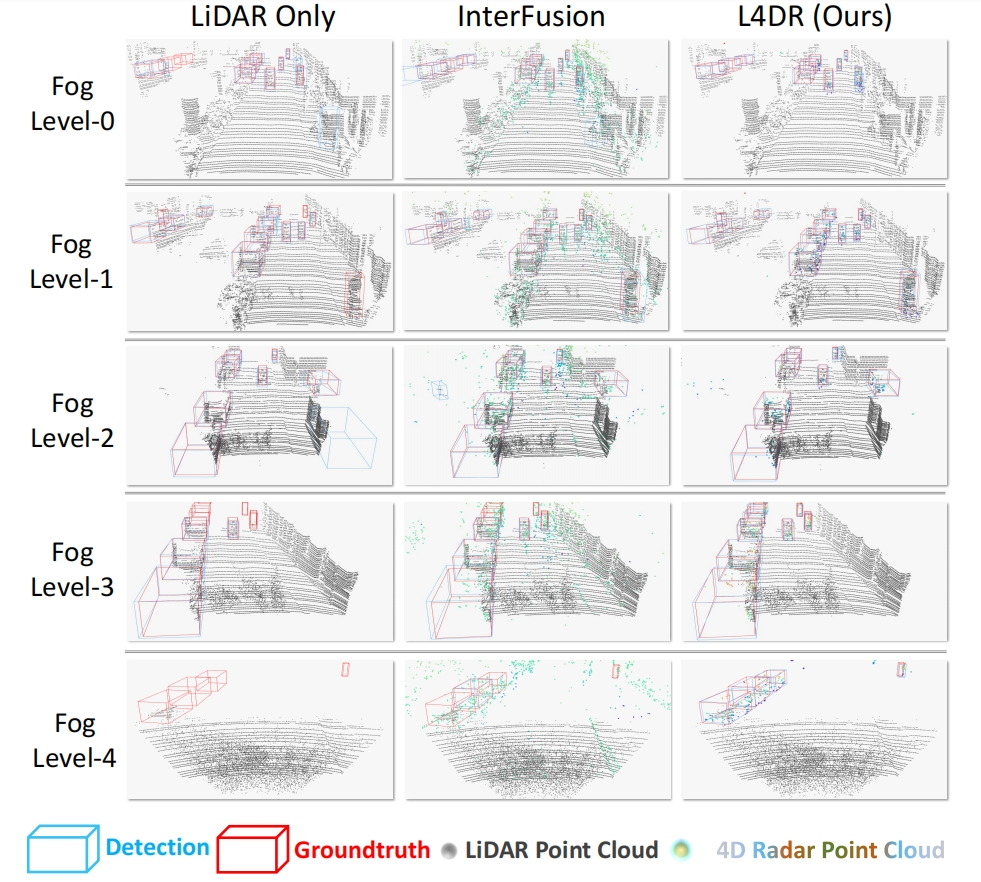

# AAAI2025 [Oral] - L4DR: LiDAR-4DRadar Fusion for Weather-Robust 3D Object Detection
:balloon:  :balloon: [](https://arxiv.org/abs/2408.03677) Congratulations to our L4DR paper was accepted by AAAI 2025 Oral (Top-4.6%) !


<p align="center">
  
  
</p>


# Introduction
:wave: This is the official repository for **AAAI2025 - L4DR**. 

This repo is also a codebase for **LiDAR-4D radar fusion** based 3D object detection on the VoD dataset!

# Installation

This code is mainly based on [OpenPCDet](https://github.com/open-mmlab/OpenPCDet). 

## 1. Clone (or download) the source code 
```
git clone https://github.com/ylwhxht/L4DR.git 
cd L4DR
```
 
## 2. Create conda environment and set up the base dependencies
```
conda create --name l4dr python=3.7 cmake=3.22.1
conda activate l4dr
pip install torch==1.10.1+cu111 torchvision==0.11.2+cu111 torchaudio==0.10.1 -f https://download.pytorch.org/whl/torch_stable.html
pip install spconv-cu113
```

## 3. Install pcdet
```
python setup.py develop
```

## 4. Install required environment
```
pip install -r requirements.txt
```

# Getting Started
The dataset configs are located within [tools/cfgs/dataset_configs](../tools/cfgs/dataset_configs) (vod related), 
and the model configs are located within [VoD_models](https://github.com/ylwhxht/L4DR/tree/main/tools/cfgs/VoD_models). 


## Dataset Preparation
### 1. Dataset download
Please follow [VoD Dataset](https://github.com/tudelft-iv/view-of-delft-dataset/blob/main/docs/GETTING_STARTED.md) to download dataset.

* (Optional)
If you want to reproduce our fog simulation-related experiments, you need to run [fog simulation](https://github.com/MartinHahner/LiDAR_fog_sim) on the VoD lidar point cloud. The relevant parts of fog simulation only need to refer to their code and configuration. 
**This part may be difficult and complex. If you need it, you can contact me to request our VoD dataset after fog simulation.**

After the preparation, the format of how the dataset is provided:

```
View-of-Delft-Dataset (root)
    ├── lidar (kitti dataset where velodyne contains the LiDAR point clouds)
      ...
    ├── radar (kitti dataset where velodyne contains the radar point clouds)
      ...
    ├── radar_3_scans (kitti dataset where velodyne contains the accumulated radar point clouds of 3 scans)
      ...
    ├── radar_5_scans (kitti dataset where velodyne contains the accumulated radar point clouds of 5 scans)
      ...
    ├── fog_sim_lidar (unique data, here was obtained through fog simulation)
      ...
```


### 2. Data structure alignment
In order to train the LiDAR and 4DRadar fusion model according to the logic of OpenPCDet, we then need to generate LiDAR and 4DRadar fusion data infos.
* First, create an additional folder with lidar and radar point clouds in the VoD dataset directory (here we call it **rlfusion_5f**):
```
View-of-Delft-Dataset (root)
    ├── lidar
    ├── radar
    ├── radar_3_scans
    ├── radar_5_scans
    ├── rlfusion_5f (mainly used)
    ├── fog_sim_lidar 
```

* Then, refer to the following structure to place the corresponding files in the rlfusion_5f folder:
```
rlfusion_5f
    │── ImageSets
    │── training
       ├── calib (lidar_calib)
       ├── image_2
       ├── label_2
       ├── lidar (lidar velodyne)
       ├── lidar_calib
       ├── pose
       ├── radar (single frame radar velodyne)
       ├── radar_5f (radar_5_scans velodyne)
       ├── radar_calib
    │── testing
       ... like training (except label)
```


### 3. Data infos generation
* Firstly, remember to change **DATA-PATH** in the [VoD dataset cfg file](https://github.com/ylwhxht/L4DR/blob/main/tools/cfgs/dataset_configs/Vod_fusion.yaml).

* Generate the data infos by running the following command: 
```
python -m pcdet.datasets.vod.vod_dataset create_vod_infos tools/cfgs/dataset_configs/Vod_fusion.yaml
```
* Final checking
Check if your VoD dataset has the following structure:
```
View-of-Delft-Dataset (root)
    ├── lidar
    ├── radar
    ├── radar_3_scans
    ├── radar_5_scans
    ├── rlfusion_5f (mainly used)
      │── gt_database
        ... 
      │── ImageSets
        ... 
      │── training
         ├── calib (lidar_calib)
         ├── image_2
         ├── label_2
         ├── lidar (lidar velodyne)
         ├── lidar_calib
         ├── pose
         ├── radar (single frame radar velodyne)
         ├── radar_5f (radar_5_scans velodyne)
         ├── radar_calib
      │── testing
         ... like training (except label)
      │── vod_dbinfos_train.pkl
      │── vod_infos_test.pkl
      │── vod_infos_train.pkl
      │── vod_infos_trainval.pkl
      │── vod_infos_val.pkl
    ├── fog_sim_lidar 
```

## Training & Testing
First, go to the tools folder:
```
cd tools
```
<div align="center">
  
</div>


### Train a model
You could optionally add extra command line parameters `--batch_size ${BATCH_SIZE}` and `--epochs ${EPOCHS}` to specify your preferred parameters. 
  

* Train with multiple GPUs
```shell script
sh scripts/dist_train.sh ${NUM_GPUS} --cfg_file ${CONFIG_FILE}
```

* Train with a single GPU:
```shell script
python train.py --cfg_file ${CONFIG_FILE}
```

For example
```shell script
CUDA_VISIBLE_DEVICES=2,3 bash scripts/dist_train.sh 2 --cfg_file cfgs/VoD_models/L4DR.yaml --extra_tag 'l4dr_demo' --sync_bn
```

### Test and evaluate the pretrained models
* We can also provide our pretrained models. If you need it, please feel free to contact me

* Test with a pretrained model: 
```shell script
python test.py --cfg_file ${CONFIG_FILE} --batch_size ${BATCH_SIZE} --ckpt ${CKPT}
```

* To test all the saved checkpoints of a specific training setting and draw the performance curve on the Tensorboard, add the `--eval_all` argument: 
```shell script
python test.py --cfg_file ${CONFIG_FILE} --batch_size ${BATCH_SIZE} --eval_all
```

* To test with multiple GPUs:
```shell script
sh scripts/dist_test.sh ${NUM_GPUS} --cfg_file ${CONFIG_FILE} --batch_size ${BATCH_SIZE}
```

For example

```shell script
CUDA_VISIBLE_DEVICES=2,3 bash scripts/dist_test.sh 2 --cfg_file cfgs/VoD_models/L4DR.yaml --extra_tag 'l4dr_demo' --ckpt /mnt/32THHD/hx/Outputs/output/VoD_models/PP_DF_OurGF/mf2048_re/ckpt/checkpoint_epoch_100.pth
```

# Other Instructions
We also provide some instructions on using our code, which will be continuously updated. Please feel free to ask any questions.
## About the evaluation results of the model

As mentioned in the paper, we provide two model evaluation strategies, KITTI and VoD. you can choose whether to use the VoD evaluation metrics or not by turning on or off **VOD_EVA** in the [VoD_fusion.yaml](https://github.com/ylwhxht/L4DR/blob/main/tools/cfgs/dataset_configs/Vod_fusion.yaml) file (and KITTI metrics if turned off).

## About fog simulation during training and testing

See our [vod_dataset](https://github.com/ylwhxht/L4DR/blob/main/pcdet/datasets/vod/vod_dataset.py) for relevant details.

Specifically, the mode is adjusted by setting self.use_fog=[0,1,2], where :
* 0 means that no fog simulation lidar is applied.
* 1 means that the fog simulation lidar of self.sim_info_path is always used
* 2 means that a 50% probability of randomly choosing a fog simulation in self.sim_info_path_list is used lidar to use, and another 50% probability that no fog simulation is applied.

We specify their usage scenarios below:
1. To test the results of normal weather training and testing, we use self.use_fog=0
2. To reproduce the results of the random addition of fog simulation in the text, we use self.use_fog=2
3. To test the results of a certain intensity of fog simulation, we use self.use_fog = 1 (of course, you can always use a certain intensity of fog lidar to do training, but it is not very recommended, mainly because there is no incentive to do so, if you like it can also be)

In this case, the fog intensity (0-4) corresponds to the following in the paper:
* w/o fog : use_fog = 0 / use_fog = 2
* fog = 1 : use_fog = 1 & path = 0.030 (beta in fog simulation)
* fog = 2 : use_fog = 1 & path = 0.060 (beta in fog simulation)
* fog = 3 : use_fog = 1 & path = 0.100 (beta in fog simulation)
* fog = 4 : use_fog = 1 & path = 0.200 (beta in fog simulation)


# Citation
If you are using our project for your research, please cite the following paper:

```
@misc{l4dr,
      title={L4DR: LiDAR-4DRadar Fusion for Weather-Robust 3D Object Detection}, 
      author={Xun Huang and Ziyu Xu and Hai Wu and Jinlong Wang and Qiming Xia and Yan Xia and Jonathan Li and Kyle Gao and Chenglu Wen and Cheng Wang},
      year={2024},
      eprint={2408.03677},
      archivePrefix={arXiv},
      primaryClass={cs.CV},
      url={https://arxiv.org/abs/2408.03677}, 
}
```

# Acknowledgements
Thank for the excellent 3D object detection codebases [OpenPCDet](https://github.com/open-mmlab/OpenPCDet).

Thank for the excellent 4D radar dataset [VoD Dataset](https://github.com/tudelft-iv/view-of-delft-dataset/blob/main/docs/GETTING_STARTED.md) to download dataset.

Thank for the excellent fog simulation work [fog simulation](https://github.com/MartinHahner/LiDAR_fog_sim).
